<div align="center">

# AriSam Tunes

**A full-stack, bilingual music streaming experience for Android**

Discover music, build playlists, listen offline, follow people, and chat in real time —
all from a native Kotlin and Jetpack Compose application backed by Ktor and PostgreSQL.


</div>

---

AriSam Tunes is a complete client–server music application built as a native Android project. It combines a responsive Compose interface, Media3 playback, local-first data, offline downloads, social profiles, and real-time messaging with a versioned REST and WebSocket backend.

The app supports both **English and Persian**, including runtime language switching, correct **LTR/RTL** behavior, and light, dark, and system themes.

The detailed implementation report and per-section contribution breakdown are available in [PROJECT_REPORT.md](PROJECT_REPORT.md).

## Table of contents

- [Demo](#demo)
- [Screenshots](#screenshots)
- [Highlights](#highlights)
- [Architecture](#architecture)
- [Technology stack](#technology-stack)
- [Repository structure](#repository-structure)
- [Getting started](#getting-started)
- [Music catalog](#music-catalog)
- [Configuration](#configuration)
- [API overview](#api-overview)
- [Testing and quality checks](#testing-and-quality-checks)
- [Production notes](#production-notes)
- [Media rights](#media-rights)

## Demo

> 🎬 A walkthrough video will be published here.

<!--
When the video is ready:
1. Save its cover image as docs/media/demo-cover.jpg.
2. Upload the video to GitHub Releases, YouTube, or another stable host.
3. Replace VIDEO_URL below and remove this comment wrapper.

<p align="center">
  <a href="VIDEO_URL">
    
  </a>
</p>
<p align="center"><strong>Click the image to watch the full demo.</strong></p>
-->

## Screenshots

<table>
  <tr>
    <th>Home &amp; Discovery</th>
    <th>Immersive Now Playing</th>
  </tr>
  <tr>
    <td align="center">
      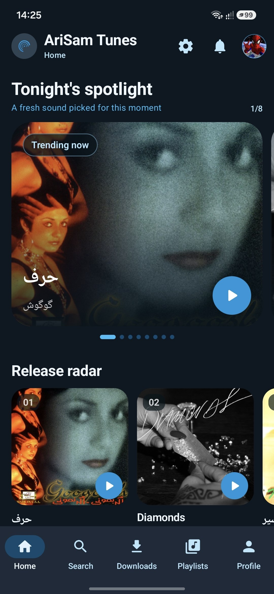
      <br><sub>Curated spotlight, release radar, and quick access to the music catalog</sub>
    </td>
    <td align="center">
      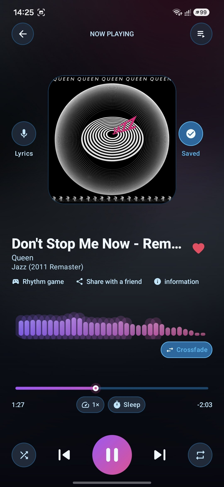
      <br><sub>Dynamic artwork, real-time visualizer, crossfade, queue, and playback controls</sub>
    </td>
  </tr>
  <tr>
    <th>Synchronized Live Lyrics</th>
    <th>Personalized Music Suggestions</th>
  </tr>
  <tr>
    <td align="center">
      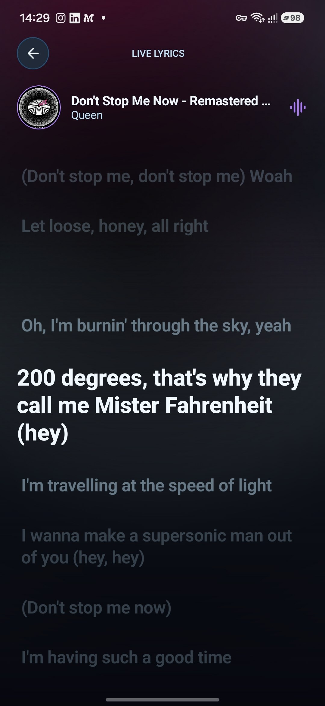
      <br><sub>Focused lyric reading with active-line highlighting and playback-aware motion</sub>
    </td>
    <td align="center">
      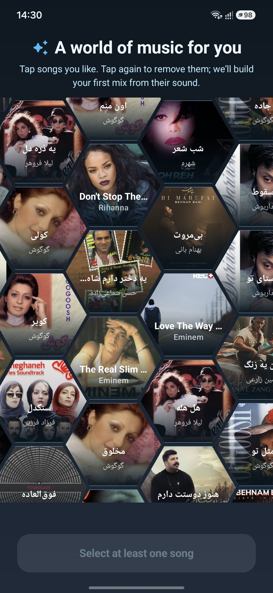
      <br><sub>Interactive hexagonal song selection for building a personalized first mix</sub>
    </td>
  </tr>
  <tr>
    <th>Fast Catalog Search</th>
    <th>Downloads &amp; Offline Playback</th>
  </tr>
  <tr>
    <td align="center">
      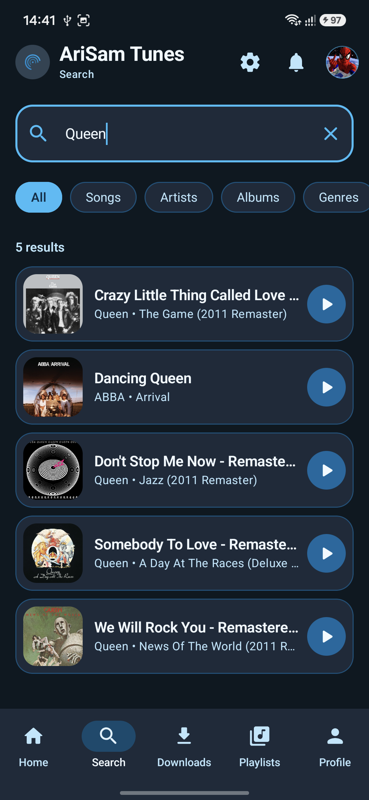
      <br><sub>Debounced search with category filters, rich metadata, and direct playback</sub>
    </td>
    <td align="center">
      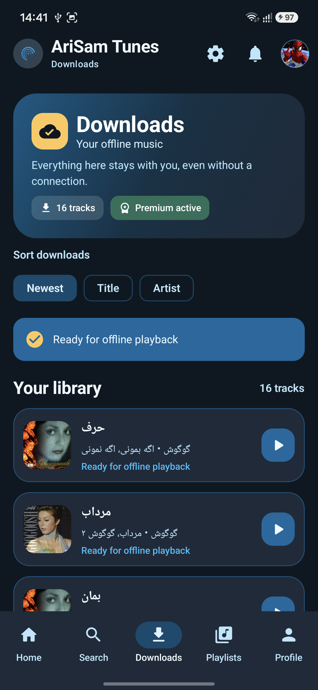
      <br><sub>Premium downloads, sorting, progress states, and local-first playback</sub>
    </td>
  </tr>
  <tr>
    <th>Playlist Details</th>
    <th>Social Profile</th>
  </tr>
  <tr>
    <td align="center">
      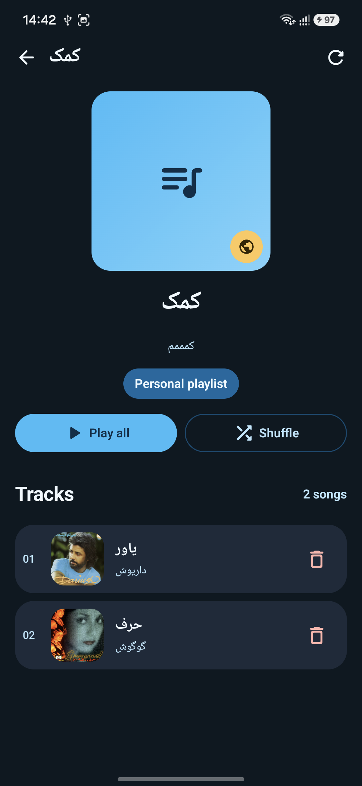
      <br><sub>Play all, shuffle, visibility, and editable track management</sub>
    </td>
    <td align="center">
      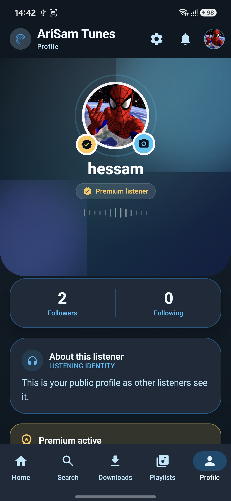
      <br><sub>Avatar, premium identity, followers, following, and public profile details</sub>
    </td>
  </tr>
  <tr>
    <th>Realtime Song Sharing</th>
    <th>Persian RTL &amp; Light Theme</th>
  </tr>
  <tr>
    <td align="center">
      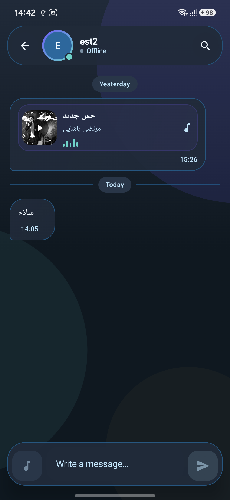
      <br><sub>WebSocket messaging, presence, shared tracks, receipts, and offline sync</sub>
    </td>
    <td align="center">
      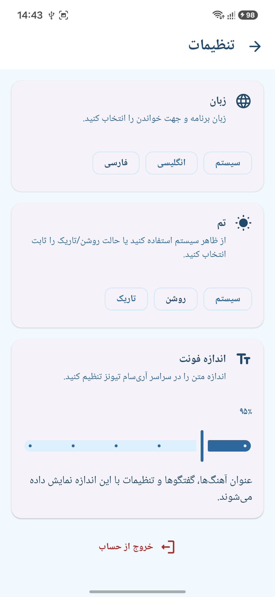
      <br><sub>Runtime localization, correct RTL direction, theme selection, and font scaling</sub>
    </td>
  </tr>
</table>

## Highlights

### Music discovery

- Five primary destinations: **Home, Search, Downloads, Playlists, and Profile**.
- Curated trending, popular, and newly released sections.
- Debounced, paginated song search with recent-search history.
- Artist pages, song details, metadata, lyrics, albums, and related content.
- Global, local, generated, and user-owned playlists.
- Personalized music suggestions and a spectrum-driven rhythm experience.
- Deep links for conversations and shared songs.

### Playback

- Media3/ExoPlayer playback managed by a foreground `MediaSessionService`.
- Background playback with system media controls and notification integration.
- Queue management, previous/next, seek, shuffle, and repeat modes.
- Playback speed, sleep timer, and optional crossfade behavior.
- Real-time PCM spectrum visualization without requiring microphone permission.
- Animated Now Playing interface, live lyrics, dynamic artwork colors, and mini-player.
- Audio-focus, headset-disconnect, and phone-call interruption handling.
- Local-first playback: a valid downloaded file is preferred over the network stream.

### Offline and local data

- Premium-gated downloads scheduled through unique WorkManager jobs.
- Download progress, retry, failure details, deletion, and offline playback.
- Room persistence for liked songs, recently played tracks, downloads, search history, followed artists, cached profiles, conversations, and messages.
- DataStore preferences for theme, language, font scale, and premium state.
- Paging 3 integration with stable loading, empty, error, and retry states.

### Social and real-time chat

- User profiles, avatars, biography editing, followers, and following lists.
- Follow and unfollow flows with locally synchronized UI state.
- Real-time WebSocket conversations and online presence.
- Typing indicators, delivery/read states, reactions, replies, editing, and deletion.
- Song sharing inside conversations.
- Offline message queue and incremental synchronization after reconnecting.
- Chat notifications with conversation deep links and inline reply support.

### Interface and accessibility

- Material 3 design system with reusable colors, typography, shapes, spacing, and components.
- Light, dark, and system themes across the application.
- English and Persian resources with runtime language switching.
- LTR/RTL-aware navigation, icons, gestures, and player controls.
- Safe system-bar insets and edge-to-edge layouts.
- Lifecycle-aware state collection and resource ownership.
- Animated transitions, stable lazy-list keys, and image error fallbacks.

## Architecture

The Android client uses a layered, state-driven architecture. Compose screens render immutable UI state from ViewModels, while repositories coordinate remote APIs, local persistence, background work, and playback.

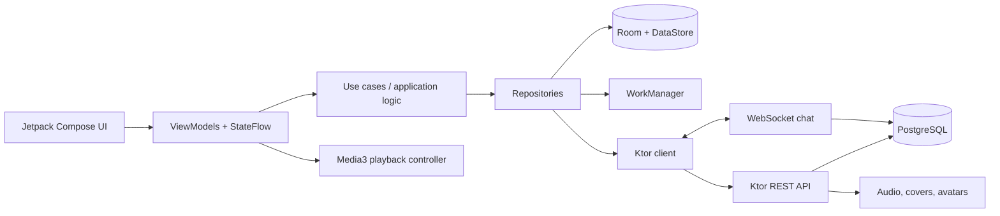

### Android data flow

1. A Compose route collects ViewModel state with lifecycle awareness.
2. The ViewModel owns screen state, actions, and one-time effects.
3. Repositories select Room/DataStore, Ktor, WorkManager, or Media3 as needed.
4. Local flows update the UI automatically after writes.
5. Network and paging errors remain retryable without discarding valid cached data.

### Backend design

- Versioned routes under `/api/v1`.
- JWT access and refresh tokens with refresh-token rotation and revocation.
- BCrypt password hashing and rate-limited authentication endpoints.
- PostgreSQL access through Exposed and HikariCP.
- Flyway migrations applied during backend startup.
- Range-enabled audio serving for streaming and seeking.
- WebSocket registry for presence, messages, typing, reactions, and receipts.
- OpenAPI documentation served through Swagger UI.

## Technology stack

### Android

| Area | Technology |
|---|---|
| Language | Kotlin |
| UI | Jetpack Compose, Material 3 |
| Dependency injection | Hilt |
| Navigation | Navigation Compose |
| Networking | Ktor Client, OkHttp, Kotlin Serialization |
| Local database | Room |
| Preferences | DataStore |
| Pagination | Paging 3 |
| Playback | Media3, ExoPlayer, MediaSession |
| Background work | WorkManager |
| Images | Coil 3 |
| Async state | Coroutines, Flow, StateFlow |

### Backend

| Area | Technology |
|---|---|
| Runtime | JVM 21 |
| Framework | Ktor 3.5 |
| Database | PostgreSQL 17 |
| SQL access | Exposed, HikariCP |
| Migrations | Flyway |
| Authentication | JWT, BCrypt |
| Real-time transport | Ktor WebSockets |
| API documentation | OpenAPI 3, Swagger UI |
| Deployment | Docker, Docker Compose |
| Media metadata | FFmpeg/ffprobe, mp3agic |

## Repository structure

```text
.
├── android/             Native Android application
│   └── app/src/
│       ├── main/        Compose UI, data, domain, player, and resources
│       ├── test/        JVM unit tests
│       └── androidTest/ Instrumented and Compose UI test sources
├── backend/             Ktor server, migrations, OpenAPI spec, and tests
├── Artists/             Artist profiles and artwork used by the Android app
├── music_data/          Development music catalog and generated covers
├── docs/                Supporting setup documentation
├── tools/               Development, deployment, and diagnostics scripts
├── PROJECT_REPORT.md    Technical report and team contribution breakdown
├── docker-compose.yml   PostgreSQL and backend services
└── .env.example         Safe environment-variable template
```

## Getting started

### Prerequisites

- JDK 21
- Android Studio with Android SDK 36
- Docker and Docker Compose
- An Android 8.0+ device or emulator
- ADB for command-line installation
- FFmpeg/ffprobe when seeding music outside Docker

### 1. Clone the repository

```bash
git clone https://github.com/Hessam-Hosseinian/AriSam-Tunes.git
cd AriSam-Tunes
```

### 2. Configure the backend

```bash
cp .env.example .env
```

Before using the project outside local development, replace `JWT_SECRET` and the default database password in `.env`.

Start PostgreSQL and the backend:

```bash
docker compose up --build -d
```

Confirm that the service is available:

```bash
curl http://localhost:8080/api/v1/health
```

Swagger UI is available at:

```text
http://localhost:8080/swagger
```

### 3. Configure the Android API URL

The Android build reads `API_BASE_URL` from the repository-level `local.properties` file.

For an emulator:

```properties
API_BASE_URL=http://10.0.2.2:8080
```

For a physical phone on the same Wi-Fi network:

```properties
API_BASE_URL=http://192.168.1.23:8080
```

Replace the example address with the computer's LAN IP. You can detect it with:

```bash
./tools/detect-lan-ip.sh
```

If `API_BASE_URL` is omitted, the Android build attempts to detect a LAN address and then falls back to `10.0.2.2`.

For a one-command LAN-aware Docker startup:

```bash
./tools/dev-compose-up.sh -d
```

This updates the ignored local `.env` file with reachable API and media URLs before starting Docker Compose.

### 4. Build and install Android

```bash
cd android
./gradlew :app:assembleDebug
adb install -r app/build/outputs/apk/debug/app-debug.apk
```

Or use the included deployment helper from the repository root:

```bash
export ANDROID_HOME=/path/to/Android/Sdk
./tools/deploy-android.sh
```

There is no default account. Register directly from the Android application after the backend is running.

## Music catalog

Put music that you are authorized to use inside `music_data/`. Supported formats are:

```text
mp3, m4a, aac, flac, ogg, wav, wma, aiff, aif
```

The seed pipeline:

- discovers audio recursively;
- removes duplicate content using SHA-256 hashes;
- reads technical metadata with ffprobe;
- reads MP3 tags and embedded artwork when available;
- falls back to folder artwork and filename-based metadata;
- generates a default cover URL when artwork is missing;
- upserts songs and artists without duplicating existing rows.

Run it after PostgreSQL is available:

```bash
cd backend
PUBLIC_BASE_URL=http://localhost:8080 ./gradlew seedMusic
```

For a physical phone, use the computer's LAN URL as `PUBLIC_BASE_URL` so returned audio and cover links are reachable from the device:

```bash
PUBLIC_BASE_URL=http://192.168.1.23:8080 ./gradlew seedMusic
```

Running the seed task again is safe: existing songs are updated by source path and identical audio files are skipped.

## Configuration

| Variable | Default | Purpose |
|---|---:|---|
| `PORT` | `8080` | Backend HTTP port |
| `PUBLIC_BASE_URL` | `http://localhost:8080` | Base URL embedded in media links |
| `DB_ENABLED` | `true` | Enable PostgreSQL-backed features |
| `DB_HOST` | `localhost` | PostgreSQL host |
| `DB_PORT` | `5432` | PostgreSQL port |
| `DB_NAME` | `arisam_tunes_db` | Database name |
| `DB_USER` | `arisam` | Database user |
| `DB_PASSWORD` | local development password | Database password |
| `JWT_SECRET` | local development secret | JWT signing secret; change outside local development |
| `MUSIC_DATA_FOLDER` | `music_data` | Music catalog root used by the seed task |
| `AVATAR_DATA_FOLDER` | `uploads/avatars` | Uploaded avatar storage |
| `API_BASE_URL` | auto-detected | Android REST/WebSocket base URL |

Local secrets and machine-specific files such as `.env`, `local.properties`, keystores, and build outputs are ignored by Git.

## API overview

All versioned REST endpoints use the `/api/v1` prefix.

| Area | Main endpoints |
|---|---|
| Health | `GET /health` |
| Authentication | `POST /auth/register`, `/auth/login`, `/auth/refresh`, `/auth/logout` |
| Profile | `GET/PUT /users/me`, avatar upload, premium status |
| Catalog | `/songs`, `/songs/search`, featured songs, song spectrum, artists |
| Playlists | global/local/user playlists and playlist-song management |
| Social | user search, profiles, followers, following, follow/unfollow |
| Chat | conversations, paginated messages, search, incremental sync |
| Real-time | `WS /api/v1/ws/chat` |
| Public sharing | `GET /share/songs/{id}` |
| Media | `/media/audio/*`, `/media/covers/*`, `/media/avatars/*` |

Use Swagger UI for the complete request/response schemas and authorization controls.

## Testing and quality checks

Run Android compilation, unit tests, and lint:

```bash
cd android
./gradlew :app:compileDebugKotlin :app:testDebugUnitTest :app:lintDebug
```

Run backend tests:

```bash
cd backend
./gradlew test
```

Useful checks before opening a pull request:

```bash
git diff --check
docker compose config
```

The test suite covers playback behavior, local-first source selection, preference validation, download decisions, metadata discovery, duplicate detection, and backend API/domain behavior.

## Production notes

This repository is configured for local development and portfolio demonstration. Before a production deployment:

- replace all development credentials and use a long random JWT secret;
- serve the API, WebSocket, and media endpoints over HTTPS;
- configure a private release keystore outside version control;
- connect premium access to a real billing and entitlement provider;
- place uploaded media behind durable object storage or a CDN;
- configure database backups, monitoring, and centralized logs;
- run device-level QA across supported Android versions and screen sizes.

The release build already enables R8 code shrinking and resource shrinking. Signing credentials are intentionally excluded from the repository.

## Media rights

Audio, artwork, avatars, screenshots, and demo footage must only be added or distributed when you own them or have permission to use them. Application source code and media rights should be reviewed separately before publishing a public build.

---

<div align="center">
  <strong>Built with Kotlin, Jetpack Compose, Ktor, and PostgreSQL.</strong>
</div>
